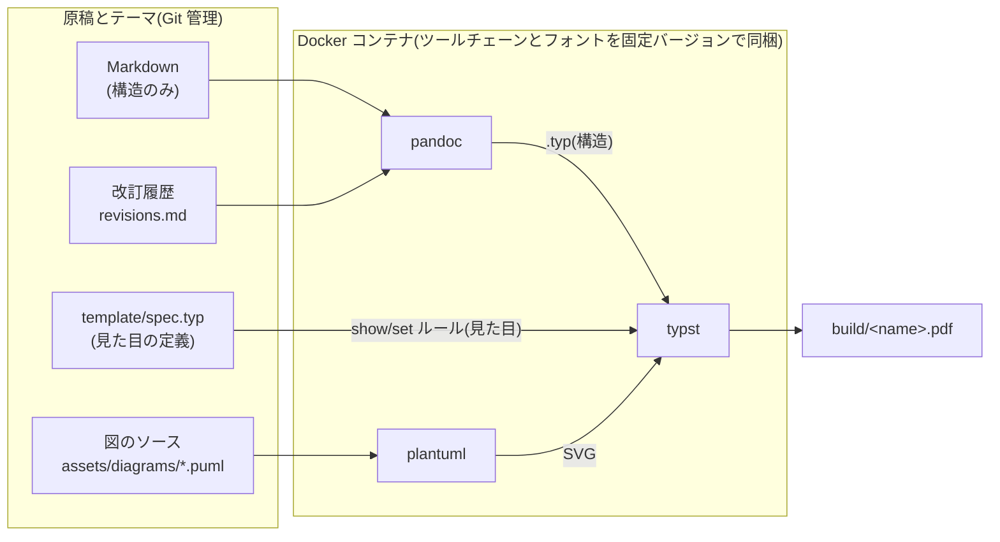

# template-jp-document

Markdown には構造だけを書き、体裁は Typst テーマに任せる日本語仕様書テンプレートです。A4 縦の PDF を生成します。

## クイックスタート

**Docker と GNU make** があれば、追加のインストールなしで同梱サンプルをビルドできます。初回は環境構築に数分かかり、2 回目以降はキャッシュが効きます。Docker の導入方法は [公式ドキュメント](https://docs.docker.com/get-started/get-docker/) を参照してください。Linux / macOS で動作し、Windows では WSL2 上での利用を想定しています。WSL2 の Ubuntu には `sudo apt install make` で make を導入できます。

```sh
make example      # 同梱サンプル 2 種(章別ファイル分割・単一ファイル)をビルド → build/*.pdf
```

pandoc / typst / plantuml とフォントは、固定バージョンとチェックサム検証を使って Docker イメージに導入されます。ローカルへのインストールは不要で、実行環境によらず同じ見た目の PDF を得られます。詳細は [guides/BUILDING.md](guides/BUILDING.md) を参照してください。自分の仕様書は、見本を `docs/` にコピーして書き始めます。

```sh
cp examples/wareki-api-spec.md docs/my-spec.md   # 単一ファイル方式(短め〜中規模の文書)
# 見本の改訂履歴も使う場合(別ファイル。本体だけコピーすると改訂履歴ページが出ない)
cp examples/wareki-api-spec.revisions.md docs/my-spec.revisions.md
make pdf SRC=docs/my-spec.md
```

章の多い文書には章別ファイル分割方式(`cp -r examples/sample-spec docs/my-spec`)を使えます。詳細は「章別ファイル分割」を参照してください。執筆ルールと記法の早見表は [guides/WRITING.md](guides/WRITING.md)、Markdown に不慣れな方向けの手引きは [guides/GETTING-STARTED.md](guides/GETTING-STARTED.md) にあります。

## 目次

- [コンセプト](#コンセプト)
- [ディレクトリ構成](#ディレクトリ構成)
- [使い方](#使い方)
- [章別ファイル分割](#章別ファイル分割)
- [執筆中の自動更新(make watch)](#執筆中の自動更新make-watch)
- [エディタ内での Typst プレビュー](#エディタ内での-typst-プレビュー)
- [執筆ルール(要点)](#執筆ルール要点)
- [レビュー・納品の運用(推奨)](#レビュー納品の運用推奨)
- [ビルド環境の詳細](#ビルド環境の詳細)
- [ライセンス](#ライセンス)

## コンセプト

Markdown と Typst の役割分担、および PDF を生成する流れを説明します。
- **Markdown → Pandoc(Typst バックエンド)→ Typst → PDF** という 2 段変換でビルドします。
- Markdown 側は見出し・表・リスト・コードブロックといった「構造」だけを記述します。フォント・配色・余白・罫線などの「美観」は一切書きません。
- 美観に関する定義は `template/spec.typ` に一元化します。デザインの変更箇所をこのファイルだけに保つことが目的です。
- Markdown 標準の記法では表現できないもの(セル結合を伴う表など)に限り、Pandoc の生 Typst 記法(エスケープハッチ)を使うことを許容します。

ビルドの流れ(すべて Docker コンテナ内で実行されます):



Pandoc は Markdown の構造解析と形式変換、Typst は組版(段組・見出し番号・和文禁則・シンタックスハイライト)を担います。Typst は LaTeX よりビルドが高速です。テーマも関数ベースの Typst コードで書けるため、体裁を一元管理しやすくなります。

## ディレクトリ構成

原稿、見本、テーマ、ビルド用ファイルの配置を示します。
```
.
├── docs/                             自分の仕様書(原稿)の置き場所。ビルド・lint の対象
├── examples/                         コピー元・参照用の見本(原則書き換えない)
│   ├── sample-spec/                  サンプル仕様書(章別ファイル分割の実例。下記「章別ファイル分割」参照)
│   │   ├── 00-meta.md                フロントマター専用ファイル(revisions をフロントマターに直接書く方式の実例)
│   │   └── 01-introduction.md 〜 99-appendix.md
│   │                                 章ファイル(ファイル名の辞書順が章順)
│   ├── wareki-api-spec.md            サンプル仕様書(単一ファイル方式。API リファレンス型のレイアウト実例)
│   └── wareki-api-spec.revisions.md  改訂履歴を別ファイル化した実例(guides/WRITING.md の「改訂履歴の別ファイル化」参照)
├── template/
│   ├── spec.typ                      テーマ本体。美観に関する定義はすべてここに集約
│   ├── template.typ                  Pandoc 用 Typst テンプレート(構造の橋渡しのみ)
│   └── plantuml.config               全 PlantUML 図に共通適用する設定(図中フォントの指定など)
├── assets/
│   ├── diagrams/                     PlantUML ソース(.puml)の置き場所。ビルド時に SVG へ自動変換(guides/WRITING.md の「図の挿入」参照)
│   ├── images/                       Markdown 本文から参照する図版(PNG/JPG/SVG)
│   └── typst-highlight.tmTheme       コードブロックのシンタックスハイライト配色(低彩度パレット)
├── scripts/
│   ├── container-build.sh            ビルド本体(`make pdf` / `make watch` が Docker コンテナ内で実行)
│   ├── lint.sh                       docs/ と examples/ の Markdown の簡易 lint(`make lint` とビルド時に実行)
│   ├── test-lint.sh                  lint.sh の回帰テスト(`make test` から実行)
│   ├── revisions-md2yaml.sh          改訂履歴の Markdown パイプ表 → YAML 変換(ビルド時に自動実行)
│   ├── puml2svg.sh                   PlantUML → SVG 変換(ビルド時に自動実行)
│   └── list-diagram-refs.sh          Markdown が参照する図の列挙(Makefile が変換対象の決定に使用)
├── guides/                           人間向けの詳細ガイド
│   ├── WRITING.md                    執筆リファレンス(記法の早見表・図・メタデータ・改訂履歴・生 Typst レシピ)
│   ├── GETTING-STARTED.md            非技術者向けクイックスタート(Markdown 初心者の PM・品証向け)
│   └── BUILDING.md                   ビルド環境の詳細(Docker・バージョン固定・チェックサム検証・フォント差し替え)
├── .vscode/                          VS Code の推奨拡張と Tinymist の設定(任意。下記「エディタ内での Typst プレビュー」参照)
├── .github/workflows/build.yml       CI(PR ごとに lint・lint.sh の回帰テスト・サンプルビルド・docs/ の自動ビルド検証を実行)
├── Dockerfile                        ビルド環境(pandoc / typst / plantuml とフォントを固定バージョンで同梱。guides/BUILDING.md 参照)
├── .dockerignore                     ビルドコンテキストの除外指定(Dockerfile は COPY を行わないため全除外)
├── Makefile                          ビルドコマンド一式
├── README.md                         このファイル
├── CLAUDE.md                         AI エージェント向けの執筆・ビルドガイド
└── LICENSE                           ライセンス(MIT。「ライセンス」節を参照)
```

`docs/` は原稿置き場、`examples/` はコピー元・参照用の見本です。`examples/` は README・guides/ 配下のガイド・CLAUDE.md から参照されるため、書き換えずに残すことを推奨します。削除する場合は、`Makefile` の `example` ターゲットと CI(`.github/workflows/build.yml`)のサンプルビルド 2 ステップも削除してください。`examples/` だけを削除すると `make example` と CI が失敗します。

`docs/` の文書は、設定変更なしで CI(`make pdf-all`)がビルドを検証します。CI は PR・main への push・週次の定期実行で起動し、PDF はワークフローのアーティファクトから取得できます。下書きなどは `_` 始まりの名前(例: `docs/_drafts/`、`docs/_memo.md`)にすると対象外になります。それ以外の規約に合わない `.md` は、ビルド漏れを防ぐためエラーで停止します。

### テンプレート本体の更新の取り込み

共通基盤の更新を取り込む方法を示します。`docs/`(原稿)と `assets/`(図版)以外の `template/` / `scripts/` / `Makefile` / `Dockerfile` / `.github/` / `guides/` は、原則として編集しません。テンプレートの複製後にバグ修正や改善を取り込む場合は、基盤ファイルだけを上書きします。

```sh
git remote add upstream <テンプレートリポジトリの URL>   # 最初の 1 回だけ
git fetch upstream
git checkout upstream/main -- template/ scripts/ Makefile Dockerfile .github/ guides/
```

`template/spec.typ` を自分でカスタマイズしている場合は上書きされるため、先に差分を確認してから取り込んでください。

## 使い方

利用できる make コマンドと、PDF ビルドの処理内容を説明します。
```sh
make pdf SRC=docs/foo.md        # 単一 Markdown ファイルをビルド(SRC は必須)
make pdf SRC=docs/foo           # 章別ファイル分割ディレクトリをビルド(下記「章別ファイル分割」参照)
make example                    # 同梱サンプル 2 種(章別ファイル分割・単一ファイル)をビルド
make pdf-all                    # docs/ 配下のビルド対象を自動発見して全件ビルド
make watch SRC=docs/foo.md      # 任意の Markdown / ディレクトリを自動リビルド(執筆中の常時起動用。下記「執筆中の自動更新」参照)
make fonts                      # エディタ内プレビュー用にフォントを .fonts/ へ書き出す(下記「エディタ内での Typst プレビュー」参照)
make lint                       # docs/ と examples/ の Markdown(単一ファイル+章別ファイル分割)の簡易 lint のみを実行
make test                       # scripts/lint.sh 自体の回帰テストを実行(原稿の執筆では通常使わない)
make clean                      # build/ を削除
make help                       # 上記コマンド一覧を表示(引数なしの make も同じ)
```

**注意**: `make pdf` / `make watch` の `SRC` は必須です。同梱サンプルには `make example` を使ってください。Make の引数分割の制約により、`SRC` のパスにはスペースを使えません。章別ファイル分割のディレクトリパスと章ファイル名も同様です。単一ファイルの `SRC` には `.md` 拡張子が必要です。改訂履歴の自動検出が `<name>.md` → `<name>.revisions.md` の命名規約に依存するためです。違反時は明確なエラーメッセージで停止します。

`make pdf` は次の段階を実行します(検証は `Makefile`、ビルド本体は Docker コンテナ内の `scripts/container-build.sh`)。

1. `SRC` の存在、章別ファイル分割の `00-meta.md` と章ファイル、参照される `.puml`、改訂履歴ファイルの併存を確認する。検証後、未構築時またはツールチェーン変更時だけ Docker イメージを構築する。
2. `scripts/lint.sh` でビルド対象の Markdown を簡易チェック(`make lint` 単体は docs/ と examples/ の `*.md` 全件 + 章別ファイル分割ディレクトリすべてが対象。改訂履歴ファイル `*.revisions.md` / `*.revisions.yaml` / `revisions.md` / `revisions.yaml` は仕様書本文ではないため対象外)。行末が CRLF(Windows のエディタが保存する改行)の原稿もそのまま検査できます。
   - **エラー(ビルド停止)**: 見出しの手動採番(`# 1. foo` / `## 2) foo` / `## 1.1. foo` / `## 1．foo` / `## (1) foo` のような「番号+ドット/括弧」形式、`# 第1章 foo` / `# 1章 foo` のような「(第)N章/節/項」形式)、YAML フロントマターの `title:` 欠落・空、章別ファイル分割時に 00-meta.md 以外の章ファイルへ YAML フロントマターが混入していること、PlantUML 参照の不備(`.puml` の直接画像参照、`/build/diagrams/<name>.svg` 形式(ルート絶対パス)以外の図の参照、参照に対応する `assets/diagrams/<name>.puml` の不存在)、`/assets/` 配下の参照先ファイル・フロントマターの `logo:` が指す画像の不存在。
   - **警告(ビルド継続)**: 見出しが数字で始まる(`## 2.5 系` のようなバージョン表記など、上記エラーパターンには一致しないが手動採番の疑いがあるケース)、生 Typst(` ```{=typst} `)ブロック内の装飾コード検出、章別ファイル分割時に同一ディレクトリ内の複数章ファイルで脚注定義 ID(`[^id]:`)が重複していること。
3. ビルド対象の Markdown が参照している PlantUML 変換図(`/build/diagrams/*.svg`)に対応するソース(`assets/diagrams/<name>.puml`)を `scripts/puml2svg.sh` で変換する(変更されたものだけを再変換。図を参照していない文書では何もしない)。
4. `pandoc --from markdown --to typst --standalone --template template/template.typ` で Markdown を Typst ソースに変換(`build/obj/<name>.typ` に出力)。章別ファイル分割の場合は 00-meta.md を含む章ファイル一覧(ファイル名の辞書順)を複数の入力として pandoc に渡す(pandoc は複数入力ファイルを連結して 1 文書として処理する)。改訂履歴を別ファイル化している場合は、`revisions.md`(または `<name>.revisions.md`)を YAML に変換したうえで(YAML 方式ならそのまま)`--metadata-file` も付与される(guides/WRITING.md の「改訂履歴の別ファイル化」参照)。
5. `typst compile --root . --font-path /opt/fonts --ignore-system-fonts` で PDF を生成(`build/<name>.pdf`)。フォントはイメージに焼き込まれたものを参照する([guides/BUILDING.md](guides/BUILDING.md) の「フォント」節参照)。

`build/` 配下は、最終成果物と中間生成物をサブフォルダで分けています。

```
build/
├── <name>.pdf          最終成果物
├── obj/                中間生成物(pandoc が生成した .typ、改訂履歴の変換 YAML)
└── diagrams/           PlantUML から変換された SVG
```

いずれも再生成できるため、Git の管理対象ではありません。`build/` ごと gitignore 済みで、`make clean` で削除できます。

## 章別ファイル分割

長い文書を章ごとのファイルに分ける方法と規約を説明します。`SRC` にはディレクトリを指定します。

```sh
make pdf SRC=docs/my-spec       # docs/my-spec/ を章別ファイル分割として扱う
```

### ディレクトリ規約

```
docs/my-spec/
├── 00-meta.md              フロントマター専用(必須)
├── 01-introduction.md      章ファイル(ファイル名の辞書順が章順)
├── 02-overview.md
├── ...
└── 99-appendix.md
```

- **`00-meta.md`**: フロントマター専用ファイル。**必須**。存在しない場合、`make pdf` は明確なエラーで停止します(章ファイルだけを置いて `00-meta.md` を忘れたディレクトリは、`make pdf-all` もビルド対象として検出できないためエラーで停止します。黙って未ビルドのまま CI が緑になるのを防ぐためです)。`title` などのメタデータ([guides/WRITING.md](guides/WRITING.md) の「メタデータ(YAML フロントマター)一覧」参照)をここに書きます。本文(見出しや段落)はここには書かず、章ファイル側に書いてください。
- **`[0-9][0-9]-*.md`**: 章ファイル。**ファイル名の辞書順がそのまま章の並び順**になります(`00-meta.md` 自身もこのパターンに一致するため、常に先頭に来ます)。1 つ以上必要です(`00-meta.md` のみでは `make pdf` がエラーで停止します)。
- **`revisions.md`(推奨)/ `revisions.yaml`(代替)**: 改訂履歴。数字プレフィックスを持たないため章ファイルの glob には含まれません。単一ファイル方式の `<name>.revisions.md` / `<name>.revisions.yaml` と同じ変換・併存エラー・`--metadata-file` の仕組みがそのまま使えます(guides/WRITING.md の「改訂履歴の別ファイル化」参照)。

### 運用上の注意

- **番号は飛ばして振ってよい**: `01-`, `02-`, `03-` の連番ではなく、`10-`, `20-`, `30-` のように間隔を空けると、既存ファイルをリネームせずに章を挿入できます(例: `10-` と `20-` の間に `15-` を挿入)。
- **フロントマターは 00-meta.md にのみ書く**: pandoc では、後方の入力ファイルのフロントマターが前方を上書きします。章ファイルに `---` で始まるフロントマターを書くと、00-meta.md の `title` などが上書き・消去されます。`scripts/lint.sh` は、00-meta.md 以外の章ファイルの先頭行が `---` ならエラーで停止します。
- **脚注定義 ID は分割全体で一意にする**: 複数の章ファイルで `[^id]: 説明` の `id` が重複すると、pandoc での連結時に脚注が衝突します。`scripts/lint.sh` は重複を警告しますが、ビルドは継続します。ユニークな名前(例: `[^ch2-note1]`)に変更してください。
- 章の自動採番・章をまたぐ相互リンク・脚注・表番号・表紙/目次は、単一ファイル方式と同様に動作します。pandoc が全章ファイルを 1 文書として処理するためです。
- `make watch SRC=docs/my-spec` は監視対象の章ファイル一覧をポーリングのたびに再導出します。**監視中に章ファイルを追加・削除しても `make watch` の再起動は不要です**(次のポーリングで自動的に反映されます)。

`examples/sample-spec/` が章別ファイル分割の実例、`examples/wareki-api-spec.md` が単一ファイル方式の実例です。

## 執筆中の自動更新(`make watch`)

`make watch` が保存後に PDF を自動更新する仕組みを説明します。

```sh
make watch SRC=docs/foo.md      # 単一 Markdown ファイルを監視
make watch SRC=docs/foo         # 章別ファイル分割ディレクトリを監視
```

1. 通常の `make pdf` 相当を 1 回実行する(lint・初回ビルドを含む)。監視は同じ Docker コンテナ内で動き、マウントされたリポジトリに対するホスト側の編集を検知する。
2. `typst watch` を起動し、`build/obj/<name>.typ` や `template/*.typ` の変更時に PDF を再コンパイルする。
3. 監視対象を 1 秒間隔でポーリングする。変更時は lint →(改訂履歴が `.revisions.md` / `revisions.md` なら YAML 変換)→ PlantUML 図の再変換(変更分のみ)→ pandoc の順に実行し、`build/obj/<name>.typ` を再生成する。`typst watch` が `.typ` の変更を PDF に反映する。対象は、原稿本体(章別ファイル分割では全章ファイル)・別ファイル化した改訂履歴・参照中の図に対応する `.puml`・`template/plantuml.config` です。原稿と `.puml` の一覧は毎回再導出するため、章ファイルの追加・削除や図の参照追加も再起動せず検知します。章ファイルを 1 つだけ編集した場合も、全章ファイルを pandoc に渡して `.typ` 全体を再生成します。

**動作上の注意**:

- Markdown の lint エラーや pandoc の変換エラーが発生しても `make watch` 自体は停止しません。エラーメッセージを表示したうえで監視を継続し、ファイルを修正して保存すると次のポーリングで自動的に再試行します。
- 終了するときは **Ctrl-C** を押してください。バックグラウンドの `typst watch` プロセスも一緒に終了します。
- PDF の自動リロードは本テンプレートの範囲外で、ビューアに依存します。対応するビューアなら、`make watch` が生成する `build/<name>.pdf` を開いたまま更新できます。Microsoft Edge など対応しないビューアでは、下記「エディタ内での Typst プレビュー」を使うと、保存のたびに VS Code 内で確認できます。
- 内部実装(`scripts/container-build.sh` の watch モード)は POSIX sh のみで書かれており、`inotifywait` / `fswatch` のような追加ツールには依存しません。

## エディタ内での Typst プレビュー

VS Code 内で仕上がりを確認する方法を説明します。[Tinymist Typst](https://marketplace.visualstudio.com/items?itemName=myriad-dreamin.tinymist) 拡張のライブプレビューを `make watch` と組み合わせます。原稿の保存時に再生成される `build/obj/<name>.typ` を開くと、PDF を経由せずプレビューが更新されます。

### 準備(最初の 1 回だけ)

1. VS Code でリポジトリルートをワークスペースとして開きます。`/assets/images/...` などのルート絶対パスを、ビルドの `--root .` と同じ基準で解決するためです。
2. `make fonts` で Docker イメージ内のフォント(`/opt/fonts`)を `.fonts/`(git 管理対象外)へ書き出します。拡張に同梱された Typst からはイメージ内を参照できません。`.vscode/settings.json` の `tinymist.fontPaths` は設定済みです。書き出すまでは和文が代替フォントになり、ビルド結果と見た目が一致しません。
3. 推奨拡張の通知から **Tinymist Typst** をインストールします(`.vscode/extensions.json` に登録済み)。

### 使い方

`make watch SRC=docs/foo.md` を起動したままにします。プレビュー対象の `.typ` の名前は `SRC` から決まり、初回ビルドで生成されます(`docs/foo.md` → `build/obj/foo.typ`、章別ファイル分割 `docs/my-spec` → `build/obj/my-spec.typ`)。この `.typ` を VS Code で開き、エディタ右上のプレビューアイコン(またはコマンドパレットで「Typst Preview」)からプレビューを開始して、原稿の隣に並べておきます。保存から反映までは数秒かかります(`make watch` が 1 秒間隔のポーリングで pandoc を再実行するため)。

**注意**:

- **成果物の PDF はあくまで `make pdf` / `make watch`(コンテナ内の Typst)が生成するものです**。プレビューは拡張に同梱された Typst でコンパイルされるためバージョンが一致するとは限らず、細部が異なる可能性があります。納品前の最終確認は必ず `build/<name>.pdf` で行ってください。
- プレビューに表示されるのは pandoc が生成した `.typ` なので、**編集するのは常に `docs/*.md` 側**です。`build/obj/*.typ` を直接編集しても次の再生成で失われます。
- **プレビューが更新されないときは `make watch` のターミナルを確認してください**。lint や pandoc がエラーになると `.typ` が再生成されず、プレビューは古い内容のまま変化しません。
- フォントを差し替えたとき(`Dockerfile` のフォント導入レイヤーを変更したとき)は、`make fonts` を実行し直してください。

## 執筆ルール(要点)

原稿を書く際に守る基本ルールを示します。詳しい記法は後述の執筆リファレンスを参照してください。

- **Markdown は構造のみ**を書きます。太字・表・コードブロック・脚注など Markdown 標準の記法だけを使い、フォント指定・色・余白などスタイルに関する記述は書きません(見た目はすべて `template/spec.typ` が自動適用します)。
- **見出しに手動で番号を振りません**。`# はじめに` と書けば「1 はじめに」のように自動採番されます(自分で番号を書くと二重になります。付録など番号を振らない章は `{.unnumbered}` を付けます)。
- **図はソースだけを Git 管理します**。画像は `assets/images/` に、PlantUML は `assets/diagrams/<name>.puml` に置き、SVG への変換はビルドに任せます(生成 SVG はコミットしません)。

記法の一覧(見出し・表・図・脚注・相互参照の早見表、一般的な Markdown との違い、メタデータ一覧、改訂履歴の別ファイル化、生 Typst レシピ)は **[guides/WRITING.md](guides/WRITING.md)** にまとめています。

## レビュー・納品の運用(推奨)

レビュー方法と納品物の推奨構成を示します。Word の変更履歴・コメント往復の代替となる運用です。

- **レビューは Git(PR)差分で行うのを基本とする**。Markdown はテキストなので、通常のコードレビューと同じ流れで行数単位の差分・コメント・提案を扱えます。
- **非技術者や社外レビュアーには PDF 注釈の往復も可**とする。Git に不慣れなレビュアー向けの代替経路であり、両方を強制する必要はありません。
- **納品時は元 Markdown 一式を PDF と併せて納める**。Markdown 一式(`docs/` 配下の原稿・参照している `assets/images/` / `assets/diagrams/` 配下の図版)を PDF と一緒に渡しておくと、受領側でのテキストの二次利用や、版間の差分確認がしやすくなります。PlantUML の図はソース(`.puml`)が原本です(受領側が画像ファイルとして必要とする場合は、ビルドで生成される `build/diagrams/` の SVG を添えてください)。
- **改訂履歴(`revisions`)の `changes` は章節番号レベルで具体的に書く**。「表現を修正」のような曖昧な記述ではなく、「4.2 共通エラー仕様に `STOCKTAKE_CONFLICT` を追加」のように、どの節の何を変えたかが分かる粒度で書いてください。受領側が改訂内容を PDF の目次・見出し番号と突き合わせて追えるようになります。

## ビルド環境の詳細

ビルド環境の構築・固定に関する次の項目は [guides/BUILDING.md](guides/BUILDING.md) にまとめています。

- Docker イメージの構成(pandoc / typst / plantuml / フォントの固定バージョンとチェックサム検証)
- ベースイメージの digest 固定
- ビルドの決定性(同じ Markdown から同じ見た目の PDF を得るための対策)・CI での検証
- フォントの詳細と別フォントへの差し替え手順
- コードブロックのシンタックスハイライト配色の変更
- 既知の制約・注意点

**参考(非サポート)**: Docker を使えない環境でも、[guides/BUILDING.md](guides/BUILDING.md) の表と同じバージョンの pandoc / typst / plantuml とフォント一式を自前で用意すれば、`make pdf` がコンテナ内で実行しているビルド本体(`scripts/container-build.sh`)を `FONT_DIR=<フォントの場所>` を指定して直接実行し、ローカルでビルドすることも可能です。バージョン・フォントの差による見た目の変化はサポート対象外です。

## ライセンス

リポジトリ内のファイルは、直下の `LICENSE`(MIT License)に従います。

フォントはリポジトリに同梱せず、Docker イメージの構築時に Adobe の公式リポジトリから取得します(sha256 検証付き)。フォント自体は [SIL Open Font License 1.1](https://scripts.sil.org/OFL) の下で配布されているもので、ライセンス条文はイメージ内の `/opt/fonts/` にフォントと併置されます。フォントの一覧・ファミリー名・差し替え手順は [guides/BUILDING.md](guides/BUILDING.md) の「フォント」節を参照してください。
